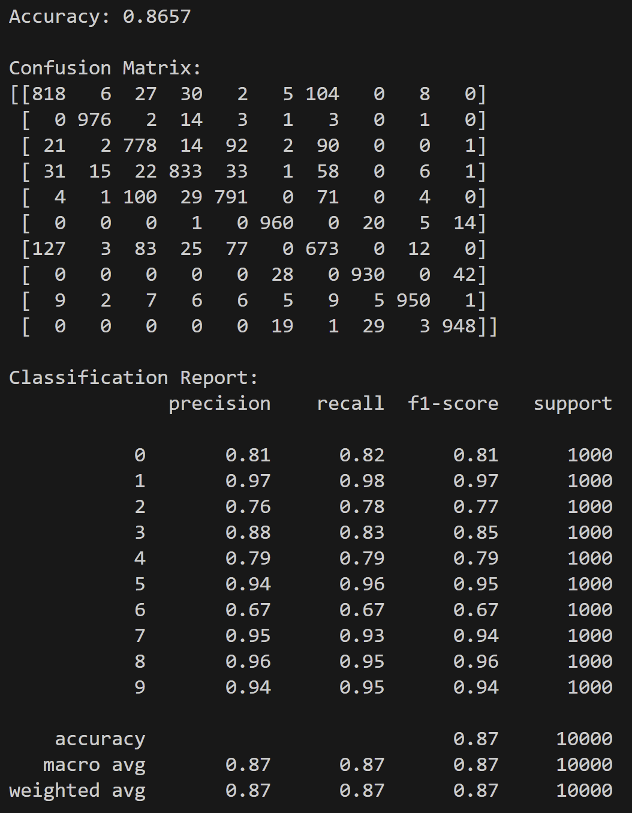
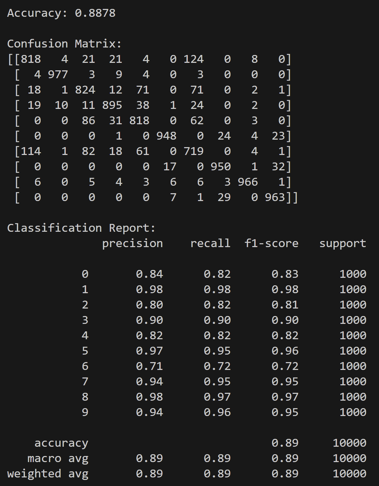
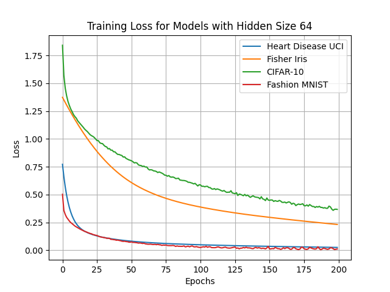
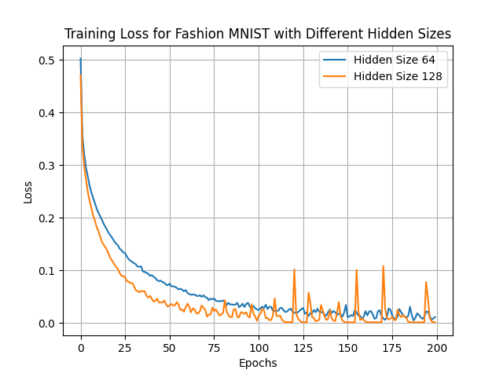

# Neural Network Classifier Project

Projekt implementujący prosty klasyfikator neuronowy przy użyciu scikit-learn.

## Instalacja zależności

```bash
pip install -r requirements.txt
```

## Uruchomienie projektu

Aby wytrenować model:

```bash
python main.py --dataset <dataset> --hidden_size <size> --max_iter <iter>
```

### Dostępne parametry:

- `--dataset`: Wybór zbioru danych (opcje: `iris`, `fashion_mnist`, `disease`, `cifar10`)
  - `iris` - Iris dataset
  - `fashion_mnist` - Fashion MNIST dataset
  - `disease` - Heart Disease dataset
  - `cifar10` - CIFAR-10 dataset
- `--hidden_size`: Rozmiar warstwy ukrytej (domyślnie: 64)
- `--max_iter`: Maksymalna liczba iteracji (domyślnie: 200)

### Przykłady:

```bash
# Iris dataset z warstwą ukrytą rozmiaru 64
python main.py --dataset iris

# Fashion MNIST z warstwą ukrytą rozmiaru 128 i 200 iteracjami
python main.py --dataset fashion_mnist --hidden_size 128 --max_iter 200

# Heart Disease dataset
python main.py --dataset disease --hidden_size 64
```

## Wyniki treningowe

### Fashion MNIST - Hidden Size 64


### Fashion MNIST - Hidden Size 128


### Learning Curve - All datasets with Hidden Size 64


### Learning Curve - Fashion MNIST with different Hidden Sizes


## Dokumentacja kodu

### Struktura projektu

- **main.py** - Główny plik z klasami `SimpleNN` (wrapper sieci neuronowej) i `Trainer` (klasa do trenowania i ewaluacji modelu)
- **data_loaders.py** - Funkcje do ładowania zbiorów danych (Iris, CIFAR-10, Fashion MNIST, Heart Disease)
- **tools.py** - Narzędzia do generowania wykresów funkcji straty
- **requirements.txt** - Lista zależności projektu

### Klasy i funkcje

#### SimpleNN
Minimalistyczny wrapper wokół `sklearn.neural_network.MLPClassifier`:
- `__init__(hidden_size, max_iter, random_state)` - Inicjalizacja sieci neuronowej
- `fit(X_train, y_train)` - Trening modelu
- `predict(X)` - Predykcja na nowych danych
- `score(X, y)` - Obliczenie dokładności

#### Trainer
Klasa do trenowania i ewaluacji modeli:
- `train(X_train, y_train)` - Trening i zbieranie historii straty
- `save_loss_to_json(filename)` - Zapis historii straty do pliku JSON
- `evaluate(X_test, y_test)` - Ewaluacja modelu
- `get_metrics(preds, labels)` - Obliczenie macierzy konfuzji i metryk klasyfikacji

#### Funkcje ładowania danych
- `get_heart_disease_data()` - Załadowanie zbioru Heart Disease UCI
- `get_iris_data()` - Załadowanie zbioru Fisher Iris
- `get_cifar10_data()` - Załadowanie zbioru CIFAR-10
- `get_fashion_mnist_data()` - Załadowanie zbioru Fashion MNIST

Wszystkie funkcje zwracają znormalizowane dane treningowe i testowe.

## Autorzy

- Kajetan Frąckowiak (s28404)
- Marek Walkowski (s25378)

