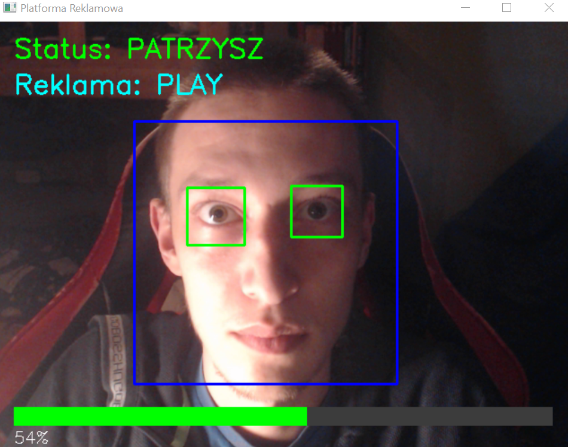
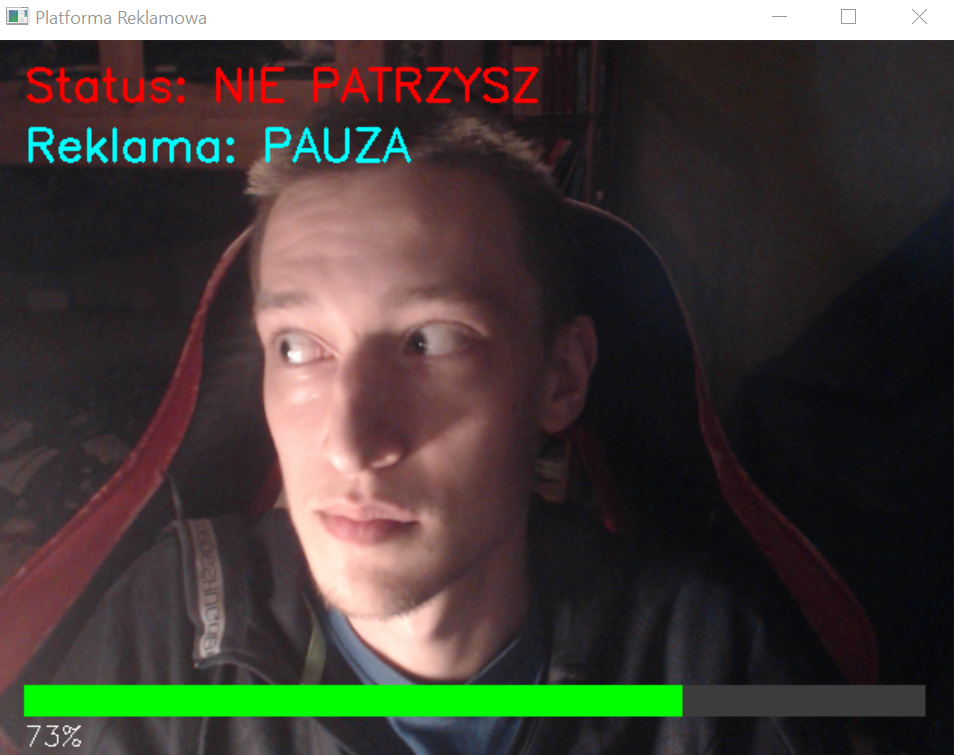
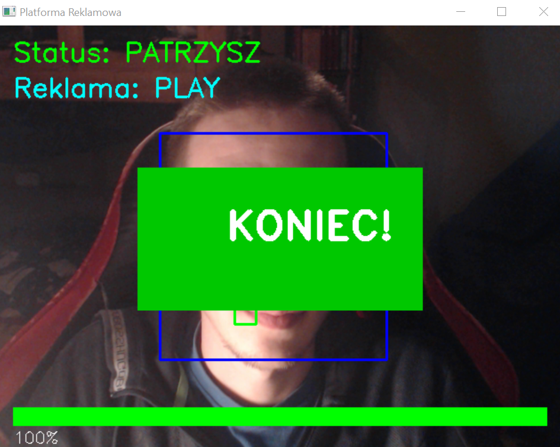

# Platforma Reklamowa z Detekcją Oczu

**Autorzy:**
- Kajetan Frąckowiak (s28404)
- Marek Walkowski (s25378)

Inteligentna platforma do wyświetlania reklam wykorzystująca detekcję oczu do wymuszania oglądania treści.

## Technologia

- **Język**: Python 3.x
- **Framework wizji komputerowej**: OpenCV (cv2)
- **Algorytm detekcji**: Haar Cascade Classifiers
- **Dokumentacja**: Pełne docstringi w kodzie źródłowym

## Wymagania

```bash
pip install -r requirements.txt
```

## Funkcjonalności (2 z 3 wymagane)

Program implementuje **wszystkie 3 funkcjonalności**:

### 1. Detekcja Oczu
- Sprawdza czy oglądający nie zamknął oczu
- Wykorzystuje Haar Cascade do wykrywania twarzy (niebieski prostokąt)
- Wykrywa oba oczy w obszarze twarzy (zielone prostokąty)
- Wymaga widocznych obu oczu aby uznać że użytkownik patrzy

### 2. Zatrzymanie Reklamy
- Automatycznie pauzuje odtwarzanie gdy użytkownik nie patrzy
- Wznawia gdy użytkownik wraca do oglądania
- Licznik postępu rośnie tylko podczas faktycznego oglądania

### 3. Alert
- Po 3 sekundach niepatrzenia wyświetla czerwony alert
- Komunikat "UWAGA! Wróć do oglądania!"
- Alert znika gdy użytkownik zacznie ponownie patrzeć

## Instrukcja Obsługi

### Uruchomienie programu

```bash
python ad_platform.py
```

### Sterowanie

| Klawisz | Działanie |
|---------|-----------|
| **Q** | Wyjście z programu |
| **R** | Reset reklamy (rozpocznij od początku) |

### Jak używać

1. **Uruchom program** - automatycznie włączy kamerę
2. **Patrz na ekran** - program wykryje twoją twarz i oczy
3. **Obserwuj status**:
   - Status: `PATRZYSZ` (zielony) / `NIE PATRZYSZ` (czerwony)
   - Reklama: `PLAY` / `PAUZA`
   - Pasek postępu: pokazuje % obejrzanej reklamy
4. **Zakończ oglądanie** - po 30 sekundach zobaczysz "KONIEC!"

### Interfejs Użytkownika

### Patrzy:


### Nie Patrzy:


### Uwaga Nie Patrzy Już Jakiś Czas


# Koniec Reklamy


## Referencje

- **OpenCV Haar Cascades**: [OpenCV Documentation](https://docs.opencv.org/4.x/db/d28/tutorial_cascade_classifier.html)
- **Viola-Jones Algorithm**: Podstawa Haar Cascade classifiers
- **Python OpenCV**: [PyPI opencv-python](https://pypi.org/project/opencv-python/)

